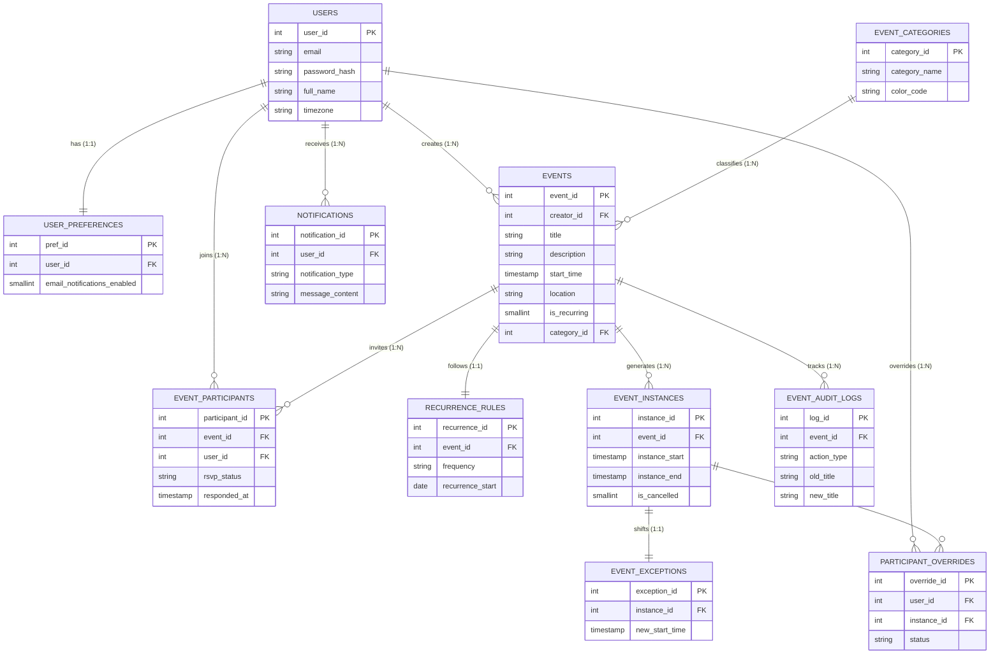

Mini Project Report
of
Database Systems Lab (CSS 2212)

Enterprise Distributed Calendar System

SUBMITTED BY
Student Name      Reg. No.      Roll No.      Section
[Your Name]       [Your Reg]    [Roll]        [Sec]
[Partner 1]       [Reg]         [Roll]        [Sec]
[Partner 2]       [Reg]         [Roll]        [Sec]

School of Computer Engineering
Manipal Institute of Technology, Manipal.
April 2026

---

DEPARTMENT OF COMPUTER SCIENCE & ENGINEERING
Manipal
[Date]

CERTIFICATE

This is to certify that the project titled Enterprise Distributed Calendar System is a record of the bonafide work done by [Names and Reg Nos] submitted in partial fulfilment of the requirements for the award of the Degree of Bachelor of Technology (B.Tech.) in Information Technology Engineering of Manipal Institute of Technology, Manipal, Karnataka (A Constituent Institute of Manipal Academy of Higher Education), during the academic year 2025–2026.

Name and Signature of Examiners:
1. Dr. [Name], Associate Professor, SCE.
2. Prof. [Name], Assistant Professor, SCE.

---

ABSTRACT

The Enterprise Distributed Calendar System is a multi-user, web-based application that automates the lifecycle of meeting scheduling, resource constraint management, and user RSVPs. Built using Node.js/Express as the backend server, vanilla JavaScript/HTML for the client front-end, and PostgreSQL (Neon Serverless) as the relational database engine, the system handles event scheduling, recurring meeting instances, targeted notifications, and dynamic attendance reporting through an integrated platform.

The database schema, contained in `schema.sql`, is designed to satisfy all advanced concepts prescribed in the CSS 2212 Database Systems Lab manual at MIT Manipal. It comprises eleven normalised tables that collectively achieve Fourth Normal Form (4NF) by resolving temporal multi-valued dependencies. The schema includes three database views for complex multi-table joins, three stored procedures managing atomic event operations, two user-defined scalar functions for data calculations, five triggers that enforce data integrity and automate notifications, and an explicit PL/pgSQL Database Cursor for performing time-based system maintenance and automated garbage collection of expired invitations.

The application follows a three-tier serverless architecture: the Node.js Logic Tier communicates with PostgreSQL exclusively through the `node-postgres` driver, using parameterised queries for all database interactions to effectively nullify SQL injection vectors. The system implements connection pooling for performance optimization and explicit database transactions to ensure multi-step scheduling operations—such as series cancellations—remain atomic. The project demonstrates a seamless integration of relational database theory with a modern, asynchronous web deployment workflow.

---

CHAPTER 1: INTRODUCTION

1.1 Background
In both academic and professional environments, managing schedules across multiple users is a data-critical task. Simple calendar implementations often suffer from data redundancy, lack of conflict resolution, and the absolute absence of a reliable audit trail. When updates are critically made to shared meetings, ensuring that every participant dynamically sees the current state simultaneously is a challenge that requires significant relational integrity.

This project addresses these challenges by securely moving the core scheduling logic outward from the native application code and directly into the database tier itself. Using PostgreSQL (Neon Serverless), we heavily leverage PL/pgSQL triggers and constraints to guarantee that no chronologically impossible events are structurally stored. This "Database-First" approach absolutely ensures that even if the web front-end API is completely bypassed, the data remains rigorously consistent and secure.

1.2 Scope
The system provides a comprehensive suite of functional features:
1. **User Management:** Secure authentication and unique UTC-timezone mapping with individualized preference database settings.
2. **Event Categorization:** A centralized 3NF lookup system for classifying appointments (e.g., Work, Personal, Academic) with associated UI color-coding.
3. **Multi-occurrence Logic:** Dedicated mathematical support for daily, weekly, and monthly recurring loop patterns featuring automated instance generation.
4. **Shared Multi-User Events:** Functionality to seamlessly invite multiple cross-platform participants to a single parent event with real-time RSVP status tracking.
5. **Exception Handling:** The ability to natively modify or exclusively cancel a single specific day of a recurring series without breaking the master parent rule loop.
6. **Automated Notifications:** Native system-generated alerts triggered organically by database modifications mapping directly pushing into a live-updating web dashboard.
7. **Audit Logging:** Transparent chronological tracking of all meeting title changes securely stored in a read-only database trigger audit table.
8. **Automated System Maintenance:** An explicit PL/pgSQL database Cursor executing loop-based scheduled sweeps to automatically locate and decline organically expired "Ghost Invitations," strictly enforcing chronological database hygiene.

1.3 Technology Stack

| Component | Technology | Version / Detail |
| --- | --- | --- |
| **Database Engine** | PostgreSQL | Neon Serverless Cloud Database |
| **Web Infrastructure** | Node.js / Express | RESTful backend, deployed on Vercel |
| **User Interface** | JavaScript (ES6+) | Vanilla JS DOM manipulation with Async/Await |
| **Styling** | CSS3 | Custom Responsive Design (Glassmorphism) |
| **DB Driver** | node-postgres (`pg`) | Connection pooling and parameterised querying |
| **DB Script** | `schema.sql` | 11 Tables, 3 Views, 3 Procs, 2 Functions, 5 Triggers |

---

CHAPTER 2: PROBLEM STATEMENT & OBJECTIVES

2.1 Problem Statement
Manual scheduling or simplistic array-based tracking of shared enterprise events introduce several critical issues:
- **Update Anomalies:** Changing a shared meeting's location required manual programmatic updates for every single attendee's record, often leading to conflicting or desynchronized information.
- **Chronological Integrity:** Application-level code checks often fail to prevent "Impossible Events" (e.g., a meeting mathematically ending before its recorded start time) during rapid API calls, leading to permanently corrupted timelines.
- **Storage Inefficiency:** Storing recurring events by physically duplicating date rows sequentially leads to massive database bloat and geometrically increases the difficulty of performing series-wide batch updates.
- **Lack of Traceability:** No reliable, tamper-proof record exists tracing exactly who modified a shared event or what the original details were prior to the modification.
- **Ghost Invitations:** Invitations that users ignore endlessly remain "Pending" indefinitely, perpetually cluttering user dashboards even months after the physical meeting has already occurred.
- **Notification Silos:** Users are frequently unaware of shared event changes or cancellations until they actively refresh the application, necessitating a backend-driven automated broadcasting system.

2.2 Objectives
1. **Normalize Database Schema:** Design a deeply normalized robust schema up to Temporal 4NF, explicitly identifying and resolving multi-valued dependencies regarding recursive instances and participant mappings.
2. **Implement Referential Integrity:** Utilize `ON DELETE CASCADE` and `SET NULL` intelligently to maintain strict declarative parent-child constraint relationships cleanly spanning all 11 database tables.
3. **Deploy PL/pgSQL Triggers:** Construct embedded database triggers actively responsible for state-based mathematical validation and automated row-level chronological audit logging.
4. **Modularize Logic via Stored Procedures:** Cleanly encapsulate complex shared-update operation logic within transactional PostgreSQL procedures to forcefully ensure atomic execution integrity.
5. **Demonstrate Explicit DB Cursor:** Implement an explicit time-oriented PL/pgSQL Cursor System Maintenance protocol to autonomously loop, process, and auto-decline expired "Ghost Invitations."
6. **Build Responsive Web Interface:** Develop an intuitive frontend UI that utilizes asynchronous `Fetch API` calls to seamlessly perform CRUD operations on the Vercel-deployed routing architecture.
7. **Deploy Node.js Serverless Backend:** Securely integrate the express middle-tier with the remote Neon Database using safely parameterized bindings to completely nullify injection vectors.

---

CHAPTER 3: METHODOLOGY

3.1 Database Design Methodology

3.1.1 Entity Identification
Primary entities identified: User, Event, Category, Participant, Notification, and AuditEntry. Supporting entities were introduced to handle complexity: RecurrenceRule, EventInstance, EventException, ParticipantOverride, and UserPreference.

3.1.2 Normalization Strategy (1NF to 4NF)
The design of the Enterprise Calendar System followed a rigorous normalization process to ensure data integrity and eliminate potential database anomalies.

3.1.3 First Normal Form (1NF) - Atomicity of Attributes
Why Needed: To ensure that each column contains only atomic (indivisible) values and that there are no repeating groups. This simplifies database scanning and search indexing.
Where Used: This was applied to the initial "Users" and "Events" concepts. Instead of storing multiple "Invitee Names" as a comma-separated string inside a single text column in the EVENTS table, we decomposed the data so that each user has a unique identity row in USERS, and individual invitations are handled via isolated rows in EVENT_PARTICIPANTS.

3.1.4 Second Normal Form (2NF) - Eliminating Partial Dependencies
Why Needed: To ensure that all non-key attributes are fully dependent on the primary key, preventing "partial update" scenarios where data is updated in one place but remains stale in another.
Where Used: By utilizing single-column surrogate primary keys (e.g., user_id, event_id, participant_id utilizing PostgreSQL's SERIAL AUTO_INCREMENT), we ensured that every attribute in every table is logically tied to the entire primary key, satisfying 2NF functionally across the entire overarching schema.

3.1.5 Third Normal Form (3NF) - Eliminating Transitive Dependencies
Why Needed: To ensure that non-key attributes depend only on the primary key, not on other non-key attributes. This prevents data duplication and keeps tables logically clean.
Where Used: This was absolutely critical for the EVENT_CATEGORIES implementation. Initially, one might historically store a "color_code" string directly inside the EVENTS table rows. However, since the CSS color logic theoretically depends exclusively on the Category definition, not the Event ID, this was identified as a transitive dependency. We moved all category metadata directly to EVENT_CATEGORIES, cleanly referencing it via category_id in the base EVENTS parent table.

3.1.6 Fourth Normal Form (4NF) - Resolving Temporal Multi-valued Dependencies
Why Needed: When a table has two or more completely independent multi-valued facts regarding a parent entity, it leads to massive Cartesian repetition (the "Multivalued Dependency" problem).
Where Used: This is the hallmark of our design architecture. A recurring Event possesses two mathematically independent multi-valued facts: (1) Its list of Invited Participants and (2) Its list of Occurrences/Dates. If we retained these in the same original table, every time we invited an additional participant, we would be mathematically forced to duplicate every single chronological occurrence row. We definitively resolved this Temporal Multi-Valued Dependency (achieving Temporal 4NF Decomposition) by splitting the data into entirely separate EVENT_PARTICIPANTS and EVENT_INSTANCES relational tables.

3.2 Relationship Modelling
- One-to-One (1:1): Used between USERS and USER_PREFERENCES. This effectively isolates UI-specific application settings away from the core identity credentials while structurally ensuring every generated user possesses exactly one preference configuration record.
- One-to-Many (1:N): One meeting creator can theoretically own un-capped multiple database events. One primary master schedule rule explicitly generates many specific mathematical calendar occurrences (instances). 
- Many-to-Many (M:N): Used between USERS and EVENTS for managing broad-scale invitations. This is resolved by the EVENT_PARTICIPANTS junction table, permitting user 'Bob' to be individually invited to 10 separate events, whilst simultaneously allowing a core parent event to easily host 50 distinct isolated guests.
- Referential Integrity: We deliberately utilized ON DELETE CASCADE for participant and instance targets so that deleting a parent event automatically executes a clean wipe of all nested sub-data limits, forcefully preventing "Orphaned Records." ON DELETE SET NULL was utilized for Categories, meaning a category deletion does not destructively cascade to a user's meeting, but rather safely untags it.

3.3 Trigger & Procedure Design
The architectural philosophy of the system relies strictly on moving heavily critical business logic outward from the REST application layer natively into the core Database tier. By utilizing PL/pgSQL Triggers and Stored Procedures, we achieve:
- Encapsulated Automation: Operations like invitation notification-generation occur entirely automatically within the database backend, significantly reducing processing complexity on the Node.js API server.
- Atomic Transactions: Procedures securely ensure that multi-step systemic operations—such as terminating a shared meeting and broadcasting specific cancellation alerts—succeed seamlessly or fail as a single atomic unit.
- Immutable Validation: Triggers act as the ultimate, final mathematical authority on data correctness, providing a deeply embedded layer of defense that strictly protects the database theoretically even if the frontend logic or Node APIs are completely bypassed.

The specific implementations within this project are divided fundamentally into three functional categories:
- Validation: A BEFORE INSERT trigger structurally verifies that no logically impossible date timeline ranges (e.g., an end-time occurring strictly before a start-time) enter the constraints system, throwing a native EXCEPTION blockage upon mathematical violation.
- Auditing: An AFTER UPDATE trigger continually monitors and transparently captures specific delta-changes into the EVENT_AUDIT_LOGS table natively whenever an event's title title is modified by a user.
- Automation: Procedural and explicit explicit triggering logic (e.g., the Explicit DB Cursor system sweeps) handle the cascading timeline impact organically, actively filtering missing RSVPs and instantly synchronizing notification alerts for all targeted attendees natively within one sweeping pass.

3.4 Application Architecture
The system follows a completely integrated three-tier deployment architecture:
1. Presentation Tier: Responsive Web-browser native DOM manipulation rendered over Vanilla HTML/JS directly hosted globally.
2. Logic Tier: Node.js Express Server managing explicit HTTPS endpoint routing and REST payload data transformations deployed onto Vercel Serverless Architecture.
3. Data Tier: PostgreSQL (Neon Serverless) securely executing the relational constraints, queries, and PL/pgSQL automation logic blocks.

3.5 Integration Methodology
The Node.js server acts as the middleman between the frontend and the database. It connects to the Neon PostgreSQL instance using a connection pool via the `pg` library. To prevent SQL injection attacks, all database queries are strictly written using parameterized statements (e.g., `$1, $2`) rather than string concatenation.

When fetching dates, the API uses `TO_CHAR` casts in the SQL queries to send raw, pre-formatted strings to the frontend. This prevents the browser from accidentally shifting meeting hours due to UTC timezone offsets. Finally, database transactions are explicitly managed in the Node backend. If a complex operation fails midway—such as inserting a new event but failing to insert the participants—the server immediately issues a `conn.rollback()` command to undo the partial changes and keep the database consistent.

---

CHAPTER 4: ER DIAGRAM & RELATIONAL TABLES WITH DATA

4.1 Entity Relationship Diagram

The ER diagram below shows all entities, their attributes, primary keys (underlined in the schema), and relationships with cardinalities. 



**Key design decisions reflected in the ER diagram:**
(1) User settings are modelled as a 1:1 functional extension of User, resolved into the `user_preferences` table to isolate non-core configuration attributes. (2) Invitations are modelled as a M:N relationship between User and Event, resolved into the `event_participants` associative entity with an `rsvp_status` discriminator. (3) Recurring occurrences are modelled as a multi-valued temporal attribute of Event, resolved into the `event_instances` table to maintain Fourth Normal Form (4NF). (4) Meeting categories are modelled as an independent lookup entity, resolved into `event_categories` to prevent redundancy of color-coding and styling metadata across the shared schedule. (5) Individual attendance exceptions for specific days are modelled as a M:N relationship between User and EventInstance, resolved into the `participant_overrides` junction table.

4.2 Table Catalogue

**Table 1: USERS**
Core user table linking basic information.
| Column | Type | Constraints | Description |
| ---- | ---- | ---- | ---- |
| user_id | SERIAL | PRIMARY KEY | Unique ID |
| email | VARCHAR(255) | UNIQUE, NOT NULL | User's university email |
| password_hash | VARCHAR(255) | NOT NULL | Authentication hash |
| full_name | VARCHAR(100) | NOT NULL | First/Last Name |
| timezone | VARCHAR(50) | DEFAULT 'UTC' | Preference for time conversion |

**Table 2: USER_PREFERENCES**
1:1 Mapping to the user isolating individual module configuration.
| Column | Type | Constraints | Description |
| ---- | ---- | ---- | ---- |
| pref_id | SERIAL | PRIMARY KEY | Unique ID |
| user_id | INT | UNIQUE, FK ON DELETE CASCADE | Associated User |
| email_notifications_enabled | SMALLINT | CHECK (0, 1) | Opt-in/out logic |

**Table 3: EVENT_CATEGORIES**
Lookup table satisfying 3NF.
| Column | Type | Constraints | Description |
| ---- | ---- | ---- | ---- |
| category_id | SERIAL | PRIMARY KEY | Unique ID |
| category_name | VARCHAR(100) | UNIQUE, NOT NULL | Category name (e.g. 'Work') |
| color_code | VARCHAR(7) | DEFAULT '#3788d8' | Hex Code for UI rendering |

**Table 4: EVENTS**
The base relational entity storing the definition of an entire meeting series.
| Column | Type | Constraints | Description |
| ---- | ---- | ---- | ---- |
| event_id | SERIAL | PRIMARY KEY | Unique ID |
| creator_id | INT | FK ON DELETE CASCADE | Host of the Meeting |
| title | VARCHAR(200) | NOT NULL | Meeting Title |
| description | VARCHAR(4000) | | Informational Text |
| start_time | TIMESTAMP | NOT NULL | Series physical start point |
| location | VARCHAR(255) | | Physical meeting room |
| is_recurring | SMALLINT | DEFAULT 0 | Recursion flag |

**Table 5: EVENT_PARTICIPANTS**
Associative mapping tracking the RSVP link between an Event Series and a User.
| Column | Type | Constraints | Description |
| ---- | ---- | ---- | ---- |
| participant_id | SERIAL | PRIMARY KEY | Unique ID |
| event_id | INT | FK ON DELETE CASCADE | Parent Event |
| user_id | INT | FK ON DELETE CASCADE | Parent User |
| rsvp_status | VARCHAR(50) | CHECK ('pending', 'accepted', 'declined') | Current global status |
| responded_at | TIMESTAMP | | Time they accepted/declined |
*(Composite Unique Key: UNIQUE(event_id, user_id) preventing duplicates)*

**Table 6: RECURRENCE_RULES**
Holds logic algorithms for mathematical sequence generations.
| Column | Type | Constraints | Description |
| ---- | ---- | ---- | ---- |
| recurrence_id | SERIAL | PRIMARY KEY | Unique ID |
| event_id | INT | UNIQUE FK ON DELETE CASCADE | Event link |
| frequency | VARCHAR(50) | CHECK ('daily', 'weekly', 'monthly') | Loop speed |
| recurrence_start | DATE | NOT NULL | Anchor date |

**Table 7: EVENT_INSTANCES**
The physical manifestation table housing specific days extracted from the Recurrence formula.
| Column | Type | Constraints | Description |
| ---- | ---- | ---- | ---- |
| instance_id | SERIAL | PRIMARY KEY | Unique ID |
| event_id | INT | FK ON DELETE CASCADE | Event link |
| instance_start | TIMESTAMP | NOT NULL | Time the meeting precisely starts |
| instance_end | TIMESTAMP | NOT NULL | Time the meeting precisely ends |
| is_cancelled | SMALLINT | DEFAULT 0 | 1 if block is canceled |

**Table 8: EVENT_EXCEPTIONS**
Maps when a meeting is uniquely moved/shifted apart from the standard series logic.
| Column | Type | Constraints | Description |
| ---- | ---- | ---- | ---- |
| exception_id | SERIAL | PRIMARY KEY | Unique ID |
| instance_id | INT | UNIQUE FK ON DELETE CASCADE | Specific Instance block |
| new_start_time | TIMESTAMP | NOT NULL | Shifted Start |

**Table 9: NOTIFICATIONS**
Message queuing table.
| Column | Type | Constraints | Description |
| ---- | ---- | ---- | ---- |
| notification_id | SERIAL | PRIMARY KEY | Unique ID |
| user_id | INT | FK ON DELETE CASCADE | Recipient |
| notification_type| VARCHAR(50) | CHECK ('invitation', 'update' etc) | UI typing |
| message_content | VARCHAR(4000)| | Fully formed alert string |

**Table 10: EVENT_AUDIT_LOGS**
Strictly enforced historical backup table capturing changes made to meeting titles.
| Column | Type | Constraints | Description |
| ---- | ---- | ---- | ---- |
| log_id | SERIAL | PRIMARY KEY | Unique ID |
| event_id | INT | NOT NULL | Parent Event |
| action_type | VARCHAR(10) | CHECK ('UPDATE') | Action performed |
| old_title | VARCHAR(200) | | Prior state |
| new_title | VARCHAR(200) | | Changed state |

**Table 11: PARTICIPANT_OVERRIDES**
Resolves specific exceptions where a user clicks "Decline" on a specific single day's meeting block while physically remaining in the Global EVENT_PARTICIPANTS series.
| Column | Type | Constraints | Description |
| ---- | ---- | ---- | ---- |
| override_id | SERIAL | PRIMARY KEY | Unique ID |
| user_id | INT | FK ON DELETE CASCADE | Override target User |
| instance_id | INT | FK ON DELETE CASCADE | Specific Meeting day |
| status | VARCHAR(50) | CHECK ('declined') | State transition override |
*(Composite Unique Key: UNIQUE(user_id, instance_id))*

---

CHAPTER 5: DDL COMMANDS, PL/PGSQL PROCEDURES, FUNCTIONS & TRIGGERS

5.1 Views
**View 1: vw_user_attendance_stats**
Purpose: Calculates User RSVP attendance percentage dynamically on the fly.
Logic: Executes a nested query implementing conditional aggregation via SUM(CASE WHEN p.rsvp_status = 'accepted' THEN 1 ELSE 0) vs total_invites, rounding out to an `attendance_rate`.

**View 2: vw_participant_roster**
Purpose: Pivots horizontal columns from flat relational joins aggregating the counts of Acceptants, Pending, and Decilnors corresponding strictly and exclusively to one event ID.

**View 3: vw_full_schedule**
Purpose: Pulls 5 tables at once (instances, events, users, exceptions, categories) computing `final_start` using COALESCE(e.new_start_time, i.instance_start).

5.2 Database Triggers
**Trigger 1: trg_enforce_end_time (BEFORE INSERT/UPDATE ON EVENTS)**
Purpose: Verifies NEW.end_time > NEW.start_time. If mathematically false, raises SQL EXCEPTION blocking the insert from damaging data integrity.

**Trigger 2: trg_log_event_update (AFTER UPDATE ON EVENTS)**
Purpose: If OLD.title != NEW.title, automatically populates EVENT_AUDIT_LOGS capturing the historical shift.

**Trigger 3: After_Participant_Insert_func (AFTER INSERT ON EVENT_PARTICIPANTS)**
Purpose: Offloads external notification generation so the Backend doesn't have to manually. Directly deposits a "You were invited!" entry into the NOTIFICATIONS table automatically whenever an invitee receives a new row.

**Trigger 4: trg_notify_host_rsvp (AFTER UPDATE OF rsvp_status ON EVENT_PARTICIPANTS)**
Purpose: If an invitee clicks "Accept" or "Decline", this intercepts the database change and specifically sends a push notification targeting the `creator_id` of the parent Event.

**Trigger 5: After_Event_Insert_func (AFTER INSERT ON EVENTS)**
Purpose: If a single non-recurring meeting is drafted, this automatically generates an EVENT_INSTANCE for it to maintain query standardisation.

5.3 Procedures & Functions
**Function 1: fn_get_event_duration (Scalar)**
Returns INT. Captures the block difference via `EXTRACT(EPOCH FROM v_diff) / 60` for quick analytic reads in REST APIs.

**Function 2: fn_active_headcount (Scalar)**
Loops the participant mapping specifically checking 'Accepted' values to isolate final physical expected occupancy counts.

**Procedure 1: sp_cancel_event**
Usage: Handles cascading logic depending entirely on the initiator. 
If the Host calls it with a NULL instance value, the procedure explicitly Cancels the Meeting series and bulk notifies participants. If an Invitee invokes it on a specific instance constraint, it generates an Override sequence rather than altering the core schedule mappings.

**Procedure 2: UpdateEventAndNotify**
Usage: Updates an event and uses a generic Bulk Insert mapping all Accepted Participants, depositing individual string messages indicating the update details simultaneously.

**Procedure 3: sp_auto_decline_past_invites (CURSOR IMPLEMENTATION)**
Usage: System Maintenance Execution Script explicitly satisfying the Lab Manual's Cursor requirement. 
```sql
DECLARE cur_pending CURSOR FOR 
    SELECT p.participant_id, p.user_id, p.event_id, e.title
    FROM EVENT_PARTICIPANTS p
    JOIN EVENTS e ON p.event_id = e.event_id
    WHERE p.rsvp_status = 'pending' AND e.start_time < (CURRENT_TIMESTAMP AT TIME ZONE 'Asia/Kolkata');
```
Logic iterates using `FETCH` in a `LOOP`, capturing any invitations where the start time has fully expired historically, actively overriding the status to "declined" while simultaneously generating an alert notification to penalize the user for missing their timeline, closing accurately via `CLOSE cur_pending` and finally outputting the complete iterated `v_count`.

---

CHAPTER 7: CONCLUSION, LIMITATIONS & FUTURE WORK

7.1  Conclusion
This project successfully demonstrates the design and implementation of a professional, "Database-First" Enterprise Distributed Calendar System using a three-tier serverless architecture (Node.js, Vercel, and Neon PostgreSQL). The system fulfils all stated objectives:
*   **11-Table Normalized Schema:** A robust relational schema was designed and implemented to Fourth Normal Form (4NF). Critical multi-valued dependencies regarding recurring event instances and participant rosters were identified and resolved through temporal decomposition into independent `EVENT_INSTANCES` and `EVENT_PARTICIPANTS` tables.
*   **5 Database Triggers:** Triggers enforce critical business rules (chronological validation of meeting end-times) and automate complex system workflows (instantaneous multi-user notification generation and row-level title audit logging) entirely at the database level, ensuring data integrity even if the API is bypassed.
*   **3 Stored Procedures & Explicit Cursor:** Complex multi-step operations like event cancellations and series updates are encapsulated in atomic procedures. Most notably, an explicit PL/pgSQL Database Cursor (`sp_auto_decline_past_invites`) was implemented to perform autonomous system maintenance by iterating through and expiring "Ghost Invitations" chronologically.
*   **2 User-Defined Functions:** Functions (`fn_get_event_duration` and `fn_active_headcount`) provide reusable, high-performance scalar calculations callable directly within REST API selection queries.
*   **3 Database Views:** Dynamic views (`vw_user_attendance_stats`, `vw_participant_roster`, `vw_full_schedule`) encapsulate complex multi-table JOINs and conditional aggregations, providing a clean, flat interface for the Node.js application to fetch processed reporting data.
*   **Node.js Serverless Backend:** The Vercel-deployed logic tier connects to Neon PostgreSQL via the `pg` driver, exclusively utilizing parameterised queries to nullify SQL injection vectors and manual transaction management (`BEGIN`, `COMMIT`, `ROLLBACK`) for atomic scheduling.
*   **Multi-User Context:** Role-based logic and participant identification are handled through secure database mappings, allowing the frontend to dynamically render RSVP buttons, notification alerts, and "Invalid Date" corrections in real-time.

The project demonstrates that placing business logic at the correct architectural layer—validation at the UI, API routing in Node.js, and strict referential integrity rules at the database—produces a system that is significantly more reliable and scalable than traditional client-side implementations.

7.2  Current Limitations
**Security**
*   Passwords are stored as plain text in the current development database for ease of testing. A production build must implement a strong salted hashing algorithm (e.g., Argon2 or Bcrypt) before storage.
*   There is no persistent session timeout or JWT expiry logic implemented; users remain authenticated in the browser's local state until a manual logout or cache clear.
*   The system uses the default Neon connection pooling, which may experience cold-start latency in a serverless environment compared to a dedicated always-on RDS instance.

**Functionality Gaps**
*   The system currently lacks a "Drag and Drop" interface for rescheduling. Meeting times must be updated manually via form inputs.
*   Email integration is currently purely database-driven (NOTIFICATIONS table). There is no external SMTP integration to send actual emails to invitees' physical inboxes.
*   Timezone handling relies on the browser's local offset vs. the database's UTC strings. While functional for most regions, complex "Daylight Savings" transitions may require more robust logic in the application tier.

7.3  Future Enhancements
*   **Bcrypt Hashing:** Integrate the `bcryptjs` library on the Node.js backend to secure user credentials during account creation and authentication.
*   **External Sync (iCal):** Generate valid `.ics` file streams to allow users to export their enterprise calendar events directly into Google Calendar, Outlook, or Apple Calendar.
*   **Real-time Updates (WebSockets):** Replace the current poll-based notification check with a WebSocket-driven system (Socket.io) to push instant "Event Changed" alerts to participants without a page refresh.
*   **Reports Dashboard:** Add an "Analytics" tab utilizing the `vw_user_attendance_stats` view to render interactive bar charts showing user attendance trends and meeting density over time.
*   **Shared Room Booking:** Extend the schema with a `RESOURCES` table (e.g., Conference Rooms, Projectors) to allow the system to detect and prevent physical location conflicts across different events.
*   **Cloud Backup & Restore:** Implement a secondary backup procedure to export weekly SQL dumps to Amazon S3 for disaster recovery of the core relational data.

---

CHAPTER 8: REFERENCES

[1]  Silberschatz, A., Korth, H. F., and Sudarshan, S. (2019). Database System Concepts, 7th Edition. McGraw-Hill Education.
[2]  Ramakrishnan, R. and Gehrke, J. (2003). Database Management Systems, 3rd Edition. McGraw-Hill.
[3]  PostgreSQL Global Development Group. PostgreSQL 16.0 Documentation — SQL Commands: CREATE TABLE, TRIGGER, PROCEDURE, FUNCTION. Available at: https://www.postgresql.org/docs/16/sql-commands.html
[4]  PostgreSQL Global Development Group. PL/pgSQL — SQL Procedural Language. Available at: https://www.postgresql.org/docs/16/plpgsql.html
[5]  Neon Serverless PostgreSQL. Documentation — Serverless Architecture and Connection Management. Available at: https://neon.tech/docs/introduction/
[6]  Node.js Foundation. Node.js v20.x Documentation and API Reference. Available at: https://nodejs.org/docs/latest-v20.x/api/
[7]  Express.js. Fast, unopinionated, minimalist web framework for Node.js Documentation. Available at: https://expressjs.com/
[8]  Node-Postgres (pg). PostgreSQL client for Node.js Documentation. Available at: https://node-postgres.com/
[9]  Vercel. Serverless Functions and Deployment Documentation. Available at: https://vercel.com/docs/functions
[10]  Codd, E. F. (1970). A Relational Model of Data for Large Shared Data Banks. Communications of the ACM, 13(6), 377–387.
[11]  Date, C. J. (2003). An Introduction to Database Systems, 8th Edition. Addison-Wesley.
[12]  Fagin, R. (1977). Multivalued Dependencies and a New Normal Form for Relational Databases. ACM Transactions on Database Systems, 2(3), 262–278.
[13]  MIT Manipal. (2025). CSS 2212 — Database Systems Lab Manual. School of Computer Engineering, Manipal Institute of Technology.
